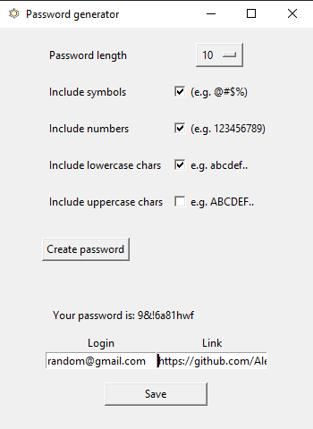

# Password generator
If you don't want to have the same password for every account you have and don't trust google random generator you can use such app to create your personal database, store it on your hard drive and use it when you need. 

## Resources Used 
**Python Version:** 3.7 

**Packages:** tkinter, strings, secrets, sqlite3, datetime 

## Instructions
* First I would recomend you to uncomment the commented part to create a database and then comment it back and start using as you want.
* Pick at least 1 option for symbols you want to be in your password. The more you have the more secure is your password.
* Press create password and write down info that refers to the account you're using this password for (e.g. Facebook) and you could provide a link.

* After pressing "Save" button your password with all info you provided is going to store in your database. Good luck!
